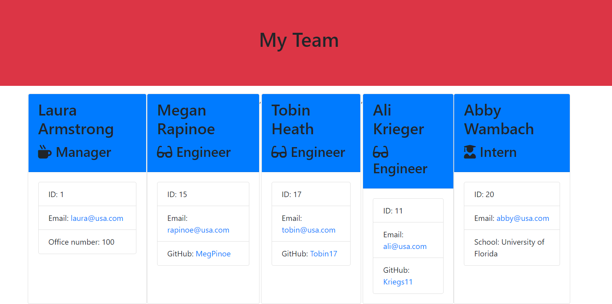

# Team-Profile
Team Profile Generator 

The user is able to use this application to create a team that consists of a manager, engineer(s), and/or intern(s). The user is prompted with questions that are based on the type of team member chosen. All employees must have a name, ID, and email. In addition, an office number is needed for a manager, a GitHub profile for a team member, and a school for an intern. The answers then create an output file that is displayed on an html page. 

https://lauraearmstrong1.github.io/Team-Profile/

